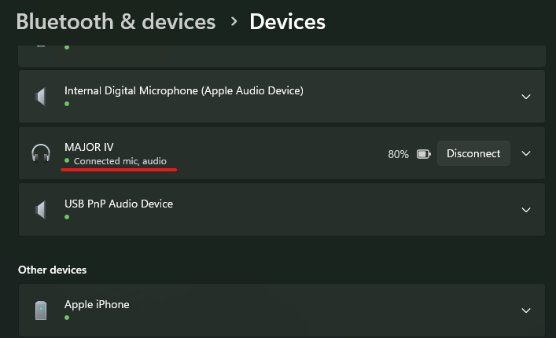

# MacBook Boot Camp Bluetooth Microphone Driver

Experimental software-only Bluetooth headset microphone (HFP) and hands-free
audio driver for Windows 10 and Windows 11 through Boot Camp on the 2019
16-inch Intel MacBook Pro (`MacBookPro16,1`). It uses the built-in Broadcom
Bluetooth controller, so no external USB Bluetooth adapter is required.

This repository contains the source for two cooperating kernel drivers, the
single-file graphical installer and local test-signing tools.

## Download the ready-to-use installer

Most users do not need Visual Studio, the WDK or a local build environment.
Download `BluetoothMicMac-HFP-Installer.exe` and `SHA256SUMS.txt` from
[the v1.0.0 release](https://github.com/djmajino/macbook-bootcamp-bluetooth-mic/releases/tag/v1.0.0),
verify the SHA-256, and run the EXE as administrator.

The published EXE is a complete graphical installer. It checks the supported
Mac model, Windows version, Boot Camp drivers, Secure Boot, Test Mode and the
current installation state before making changes. It can also uninstall the
custom drivers and restore the original Windows configuration.

The current binary uses a local self-signed test certificate and does not have
a Microsoft production kernel signature. Secure Boot must be disabled, and
Windows Test Mode must remain enabled while the drivers are loaded. Read the
safety notes below before installing it.

### Install the ready-to-use package

On the supported MacBook, first make sure the original Boot Camp Bluetooth
stack can pair and use ordinary Bluetooth devices.

A self-signed kernel driver requires Windows Test Mode for the entire time the
driver is loaded, not just during installation. The installer cannot disable
firmware Secure Boot for you.

1. Download `BluetoothMicMac-HFP-Installer.exe` from GitHub Releases.
2. Right-click it and select **Run as administrator**.
3. Review the complete prerequisite checklist.
4. Select **Install**.
5. If required, approve enabling Test Mode. The computer restarts and setup
   resumes automatically after the same user signs in.
6. Reconnect the Bluetooth headset.
7. Select `Headphones (<device>)` for output and `Headset (<device>)` for input.

Starting the microphone switches Bluetooth audio to the HFP voice path. Lower
mono playback quality while the microphone is active is a Bluetooth HFP
limitation.

The installer's **Uninstall / restore Windows** operation removes only this
project's exact root device and driver packages, restores the Boot Camp path,
removes the public test certificate and disables Test Mode. If another custom
driver also relies on Test Mode, review that consequence before uninstalling.

If you prefer to inspect the implementation or do not want to trust the
prebuilt EXE, clone this source repository and follow
[Build from source](#build-from-source).

## Read this first

These are experimental kernel-mode drivers. A bug can cause a Windows crash,
make Bluetooth unavailable or disconnect a Bluetooth keyboard and mouse. The
code is not approved by Apple and a locally test-signed build is not approved
or certified by Microsoft.

The current hardware match is intentionally limited to:

- `MacBookPro16,1` (16-inch Intel MacBook Pro, 2019)
- Intel UART hardware ID `PCI\VEN_8086&DEV_A328&SUBSYS_72708086`
- Windows 10 version 1903 (build 18362) or later, x64; Windows 11 is included
- Apple's Boot Camp Broadcom Bluetooth drivers already installed and healthy

Do not remove the hardware restriction without validating the UART transport
on the new target. Keep a backup and a non-Bluetooth input device available
while testing.

## How it works

The Boot Camp Bluetooth stack can negotiate HFP, but requests SCO voice audio
through a vendor PCM sideband route that is not exposed to the Windows audio
engine on this Mac.

`UartH4Probe` is an upper filter on the exact Intel Serial IO UART. For an HFP
stream it changes only the synchronous voice connection's data path from the
unavailable sideband route to HCI, then bridges incoming and outgoing H4 SCO
packets through bounded kernel rings.

`BthHfpAudio` is a PortCls/WaveRT driver derived from Microsoft SysVAD. It
discovers HFP HCI-bypass devices and exposes their hands-free speaker and
microphone endpoints to Windows. The normal Boot Camp stack continues to own
pairing, HFP control, codec negotiation, A2DP and non-SCO Bluetooth traffic.

See [docs/ARCHITECTURE.md](docs/ARCHITECTURE.md) for more detail.

## Proof of operation

The Windows Bluetooth device page below reports a paired headset as
**Connected mic, audio**, showing that Windows exposes both microphone capture
and audio playback through the MacBook's built-in Bluetooth controller.



## Build from source

Use this option if you want to audit or modify the implementation and create a
fresh installer signed with your own local test certificate.

### Prerequisites

Use a Windows 10 or Windows 11 x64 development machine. Building does not need
administrator rights, but installing and trusting a test certificate does.

Install:

1. Visual Studio 2022 or Visual Studio 2022 Build Tools.
2. The **Desktop development with C++** workload.
3. MSVC v143 x64/x86 build tools.
4. MSVC v143 Spectre-mitigated libraries for x64/x86.
5. Windows 11 SDK `10.0.26100.0` or a compatible newer SDK.
6. Windows Driver Kit (WDK) `10.0.26100.0` or a compatible newer WDK, including
   the Visual Studio integration component.
7. Windows PowerShell 5.1 or PowerShell 7.

Microsoft's current WDK download page is:
https://learn.microsoft.com/windows-hardware/drivers/download-the-wdk

After installation, verify tool discovery from the repository root:

```powershell
Set-ExecutionPolicy -Scope Process Bypass -Force
.\scripts\Get-BuildTools.ps1 | Format-List
```

It should report MSBuild, Inf2Cat, InfVerif and SignTool paths.

### Get and audit the source

Clone this repository directly, or create a GitHub fork and clone the fork
using its **Code** button:

```powershell
git clone https://github.com/djmajino/macbook-bootcamp-bluetooth-mic.git
cd macbook-bootcamp-bluetooth-mic
Set-ExecutionPolicy -Scope Process Bypass -Force
.\scripts\Test-PublicTree.ps1
```

The audit rejects binaries, certificates, private-key formats, dumps, traces,
common token formats and local Windows user paths from the tracked source tree.

### Build with Codex

The repository contains a root `AGENTS.md` that Codex reads automatically when
started from this Git workspace. After cloning on Windows, open Codex in the
repository and use this prompt:

```text
Make it work for local testing. Check all prerequisites, build and test-sign
the drivers with a new local non-exportable certificate, build the installer,
verify every signature, and do not install or reboot anything.
```

Codex will follow the same audited scripts documented below. Installation,
Test Mode changes and restarts remain separate approval-requiring actions. See
[docs/CODEX.md](docs/CODEX.md) for more prompts and verification instructions.

### Build and locally test-sign everything

This is the easiest development workflow. It creates a self-signed certificate
whose private key remains non-exportable in the current user's Windows
certificate store. Only the public `.cer` is copied to ignored build output.

Open PowerShell in the repository root:

```powershell
Set-ExecutionPolicy -Scope Process Bypass -Force
$testCertificate = .\scripts\New-TestCertificate.ps1 `
    -Subject 'Bluetooth Mic Mac Local Test'

.\build-all.ps1 `
    -Configuration Release `
    -CertificateThumbprint $testCertificate.Thumbprint `
    -BuildInstaller
```

The command performs these operations in order:

1. Rebuilds `UartH4Probe.sys`, `UartH4Query.exe` and `BthHfpAudio.sys` as x64.
2. Runs INF verification and creates unsigned catalogs.
3. Signs each SYS with your selected certificate.
4. Regenerates each catalog so it hashes the signed SYS.
5. Signs each CAT and exports the matching public CER.
6. Verifies the signatures.
7. Builds the native root-device helper.
8. Embeds the signed payload in the graphical single-file installer.
9. Signs the installer EXE with the same certificate.

Expected output:

```text
artifacts\Release\unsigned\uart\
artifacts\Release\unsigned\hfp\
artifacts\Release\signed\uart\
artifacts\Release\signed\hfp\
artifacts\Release\installer\BluetoothMicMac-HFP-Installer.exe
```

All of `artifacts` is ignored by Git.

### Build without signing

```powershell
Set-ExecutionPolicy -Scope Process Bypass -Force
.\scripts\Build-Drivers.ps1 -Configuration Release
```

Unsigned packages are written below `artifacts\Release\unsigned`. Windows x64
will not load these kernel drivers on a normal retail boot.

### Rebuilding only the installer

After signed packages exist under `artifacts\Release\signed`:

```powershell
.\installer\build.ps1 `
    -Configuration Release `
    -CertificateThumbprint $testCertificate.Thumbprint
```

The build script derives the driver hashes and versions from the current
payload. It contains no repository-specific certificate thumbprint.

### Cleaning

Generated output is contained in `artifacts`, `build` and component-local build
directories. These paths are ignored by Git. To start clean, remove only those
directories or use Visual Studio's Clean target. Keep their contents out of the
shared source tree.

## Repository layout

```text
uart_h4_probe/       KMDF UART filter, public bridge header and query tool
hfp_audio/           HFP PortCls/WaveRT projects and INF source
installer/           GUI bootstrap, payload scripts and native helper
scripts/             tool discovery, build, signing and privacy audit
vendor/              required modified Microsoft SysVAD source subset
docs/                design documentation
artifacts/           generated output; ignored and absent from Git
```

## Privacy check

```powershell
.\scripts\Test-PublicTree.ps1
```

Never include PFX/P12/PVK files, private keys, certificates, SYS/CAT/PDB files,
crash dumps, ETL traces, audio recordings, event logs or complete local device
instance paths in a shared source archive. Remove personal data from diagnostic
extracts before sharing them.

## License

Project-specific code is available under the MIT License. The modified
Microsoft SysVAD subset remains under the Microsoft Public License. See
[THIRD_PARTY_NOTICES.md](THIRD_PARTY_NOTICES.md).
